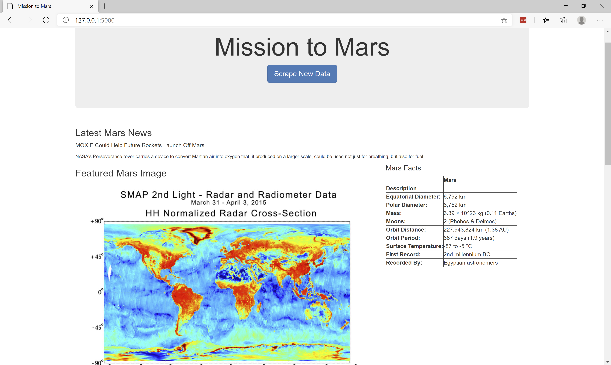

# Mission to Mars

This repository has a web application that scrapes various websites for data related to the Mission to Mars and displays the information in a single HTML page. 

* Jupyter Notebook file [`mission_to_mars.ipynb`](Mission_to_Mars/MissionToMars.ipynb) has the scraping script, which has been built using BeautifulSoup, Pandas, and Requests/Splinter
* Python script ['scrape_mars.py'](Mission_to_Mars/scrape_mars.py) also has scraping scripts and retuns a Dictionary of Data to the calling function
* Python script ['app.py'](Mission_to_Mars/app.py) utilizes flask to display the data in html format.

Here are some screenshots from the App.

